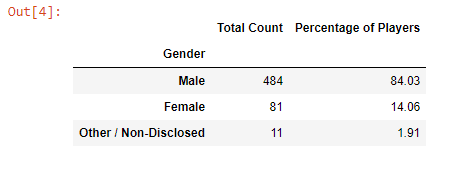
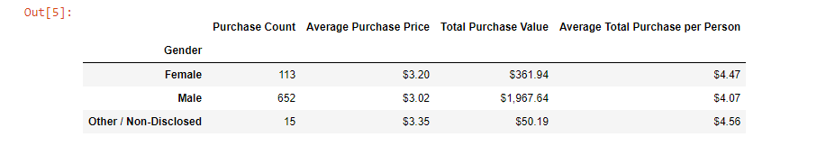
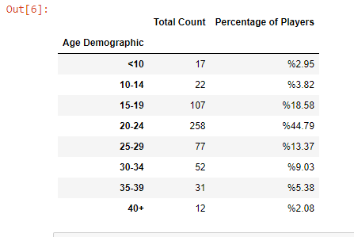
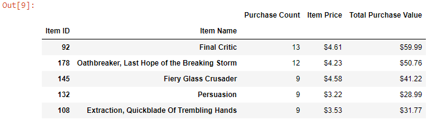

# Heroes Of Pymoli (fantasy game Data Analysis)

Heroes of Pymoli is a fantasy game of which is free-to-play, but players are encouraged to purchase optional items that would enhance their playing experience. In this report, I will analyze the game's purchasing data to draw meaningful insights.

هيHeroes of Pymoli  عباره عن لعبة من وحي الخيال قد قمت بتحليل البيانات فيها لمعرفه أكثر الأدوات مبيعاً في اللعبه من قبل المتنافسين فيها ليطورون أدؤهم.

# Methods used:

(Pandas) Python programming language is the only tool used for the analysis. The purchase data is analyzed based on gender demographics, age demographics, most popular items and most profitable items.

استخدمت في هذا المشروع برنامج البايثون3 \ مكتبة Pandas. تحليل بيانات المشتريات الاكثر مبيعاً تعتمد على التركيبة السكانية للجنس والعمر واكثر المشتريات من حيث العوائد الماليه.   
# ANALYSIS:

We observe that $2,379.77 total revenue was generated by the 780 transactions. In these transactions, 179 unique items were purchased by 576 players.

According to purchase data, 484 of the players declared themselves as "Male" (84%), 81 of them "Female" (14%) and 11 of them "Other/Non-disclosed (2%) (see the table below).

بعد قيامي بالعمليات التحليليه اللازمه تبين ان مجموع العوائد الماليه هو $ 2,379.77 
780 تحويل بنكي بعد تحليل البيانات للعوائد تبين لي ان 179 من المشتريات الغير متكرره كات العمليات الشرائيه ل576 لاعب.
484 لاعب "ذكور" بنسبة(84 %) و81 "اناث" أي (14%)، 11 غير متم عملية الشراء بنسبة(2%). 

We see that 652 purchases were made by male players while female players made 113 purchases. $1,967.64 total revenue was generated from purchases made by male players while $361.94 total revenue was generated from the purchases made by female players (see the table below).

45% of the purchases were made by the players in the age group 20-24 and $1,114.06 total revenue was generated from these purchases(see the table below). 

"Oathbreaker, Last Hope of the Breaking Storm" is the most popular item that was purchased by 12 times. $50.76 total revenue was generated by these purchases (see table below). 

## CONCLUSIONS & RECOMMENDATIONS

According to purchase data of Heroes of Pymoli fantasy game, male players and the players in the 20-24 age group generate more revenue. Marketing campaigns focusing on these groups will have more possibility to increase revenue. Marketing campaigns increasing the visibility of popular items will bring more revenue. 

